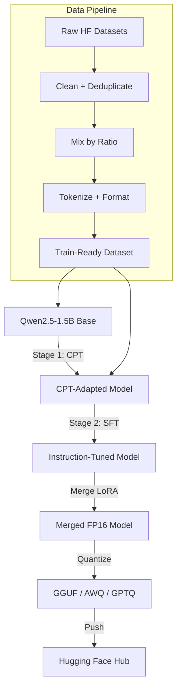

# Project Overview - Baligh-1.5B v0

## What This Project Is

**Baligh-1.5B v0** = Arabic-first, Islamic-knowledge-specialized LLM (~1.54B params):

- **Base**: Qwen2.5-1.5B Base (non-instruct), 28 layers, GQA, 32K context.
- **Stage 1 — CPT**: Continued Pretraining on 20–50B Arabic tokens  
  Rough mix: ArabicWeb24 (~70%), ArabicText-Large (~20%), ArabicPile (~10%), plus an Islamic-focused cycle.
- **Stage 2 — SFT**: Instruction tuning on 100K–500K Arabic examples  
  Rough mix: CIDAR (~40%), evol-instruct-arabic (~35%), Gazelle (~10%), summarization (~10%), Islamic QA (~5%). 
- **Method**: QLoRA 4-bit (e.g. r=16, alpha=16) via Unsloth → merge adapters → quantize (GGUF / AWQ / GPTQ).
- **Release**: Hugging Face Hub (`Kandil7/Baligh-1.5B`) with:
  - Base + merged + quantized variants
  - Model cards with eval tables
  - Evaluation reports on Arabic and Islamic benchmarks

## Target Users

- Arabic NLP researchers & developers
- Islamic knowledge applications (Quran/tafsir/fiqh QA tools)
- Arabic-first assistants and chatbots

## Non-Goals

- Not a general-purpose chatbot for all domains
- Not a fatwa authority (no binding religious rulings)
- Not multilingual (Arabic-first, English secondary)
- Not a replacement for RAG (requires retrieval for high factuality)

---

## High-Level Architecture



---

## Project Structure

```text
Baligh/
├── src/
│   ├── baligh/
│   │   ├── __init__.py
│   │   ├── config.py              # Pydantic config (BaseConfig, CPTConfig, SFTConfig, etc.)
│   │   ├── constants.py           # Paths, dataset ratios, model constants
│   │   ├── data/
│   │   │   ├── loader.py          # HF dataset loading (20+ datasets registered)
│   │   │   ├── cleaner.py         # HTML/URL removal, Arabic normalization, quality filters
│   │   │   ├── mixer.py           # interleave_datasets by ratio (CPT/SFT)
│   │   │   ├── formatter.py       # CPT packing + SFT chat template (Qwen format)
│   │   │   ├── validators.py      # Schema + quality validation
│   │   │   ├── datasets.py        # Dataset registry with metadata
│   │   │   └── __init__.py
│   │   ├── training/
│   │   │   ├── cpt_trainer.py     # CPT training loop
│   │   │   ├── sft_trainer.py     # SFT training loop (TRL SFTTrainer + response-only loss)
│   │   │   ├── lora_config.py     # LoRA/QLoRA config (r, alpha, target modules)
│   │   │   ├── callbacks.py       # Logging, memory, checkpoint callbacks
│   │   │   ├── metrics.py         # Loss, perplexity, etc.
│   │   │   ├── checkpoint.py      # Save/load/cleanup checkpoints
│   │   │   └── __init__.py
│   │   ├── evaluation/
│   │   │   ├── evaluator.py       # Main evaluator (generate + batch eval)
│   │   │   ├── metrics.py         # ROUGE, BLEU, BERTScore, Exact Match, Perplexity
│   │   │   ├── benchmarks.py      # MMLU-Arabic, CIDAR, mr-tydi, Islamic QA
│   │   │   ├── human_eval.py      # Human eval rubric (1–5)
│   │   │   ├── reporters.py       # JSON/Markdown report generation
│   │   │   └── __init__.py
│   │   ├── models/
│   │   │   ├── loader.py          # load_base_model (4-bit QLoRA), apply_lora, merge_lora
│   │   │   ├── tokenizer.py       # Qwen2.5 tokenizer + chat template
│   │   │   ├── quantization.py    # GGUF (q4_k_m), AWQ, GPTQ
│   │   │   └── __init__.py
│   │   ├── inference/
│   │   │   ├── generator.py       # TextGenerator (single/batch)
│   │   │   ├── chat.py            # ChatBot (history + system prompts)
│   │   │   ├── structured.py      # JSON / structured generation with retries
│   │   │   └── __init__.py
│   │   └── utils/
│   │       ├── logging.py         # Loguru setup (JSON/text, rotation)
│   │       ├── seeding.py         # set_seed (Python, NumPy, Torch, CUDA)
│   │       ├── distributed.py     # DDP helpers
│   │       ├── memory.py          # Memory diagnostics & tracking
│   │       └── __init__.py
│   ├── scripts/
│   │   ├── prepare_data.py        # MAIN: download → clean → mix → format → validate → export
│   │   ├── run_cpt.py             # CPT training (reads YAML)
│   │   ├── run_sft.py             # SFT training (reads YAML)
│   │   ├── run_eval.py            # Evaluation entrypoint
│   │   ├── merge_lora.py          # Merge adapters
│   │   ├── quantize.py            # GGUF/AWQ/GPTQ
│   │   ├── push_to_hf.py          # Push models & artifacts to HF Hub
│   │   ├── generate_model_card.py # Auto-generate model card
│   │   └── run.py                 # Colab CLI runner
│   └── notebooks/
├── configs/
│   ├── base/                      # model.yaml, tokenizer.yaml, hardware.yaml
│   ├── cpt/                       # cpt-stage1.yaml, cpt-stage2.yaml, cpt-islamic.yaml
│   ├── sft/                       # sft-stage1.yaml, sft-stage2.yaml
│   └── eval/                      # eval-config.yaml
├── docker/                        # Dockerfile.cpt, Dockerfile.sft, Dockerfile.eval, docker-compose.yml
├── .github/workflows/             # CI, CPT, SFT, Release
├── colab_cli/                     # Colab notebooks + runner
├── docs/
│   ├── architecture/
│   ├── data/
│   ├── training/
│   ├── evaluation/
│   ├── release/
│   ├── blueprint/
│   ├── learning/                  # ← this documentation lives here
│   └── plan/
├── requirements/                  # base.txt, training.txt, eval.txt, dev.txt, deployment.txt
├── pyproject.toml
├── Makefile
└── README.md
```

---

## Key Entry Points

1. `src/scripts/prepare_data.py` — Download, clean, mix, format, validate, export datasets
2. `src/scripts/run_cpt.py` — Run CPT training
3. `src/scripts/run_sft.py` — Run SFT training
4. `src/scripts/run_eval.py` — Run evaluation on benchmarks
5. `colab_cli/run.py` — Google Colab runner
6. `src/baligh/config.py` — All configuration classes

---

## Configuration System

All configuration is managed through **Pydantic BaseSettings** (`src/baligh/config.py`):
- `BaseConfig` — Environment variables, paths, hardware, logging, reproducibility
- `ModelConfig` — Model name, tokenizer, quantization settings, attention implementation
- `LoRAConfig` — LoRA rank, alpha, dropout, target modules
- `CPTConfig` — Dataset mix ratios, training hyperparameters, packing settings
- `SFTConfig` — Dataset mix ratios, training hyperparameters, response-only loss
- `EvalConfig` — Benchmark selection, generation parameters, human eval rubric
- `QuantizationConfig` — GGUF, AWQ, GPTQ settings

Each config class is a frozen dataclass (immutable) with sensible defaults.

---

## Training Method: QLoRA 4-bit

The core training innovation is **QLoRA** (Quantized Low-Rank Adaptation):
1. Load the base model in 4-bit precision using NF4 (Normal Float 4) quantization via BitsAndBytes.
2. Freeze all base model weights.
3. Inject LoRA adapter matrices (rank=16) into attention and MLP layers.
4. Only train the adapter parameters (~0.1% of total params).
5. After training, merge adapters back into the full-precision model.
6. Optionally re-quantize for deployment (GGUF for llama.cpp, AWQ for vLLM, GPTQ for text-generation-inference).

---

## Evaluation Strategy

Baligh is evaluated on:
- **MMLU-Arabic** — Multiple-choice knowledge benchmark in Arabic
- **CIDAR** — Arabic instruction-following benchmark (ROUGE, BLEU)
- **mr-tydi-arabic** — Arabic retrieval-augmented QA
- **Islamic QA (custom)** — Fiqh, hadith, tafsir questions (ROUGE, exact match)
- **Perplexity** — Language modeling quality on held-out Arabic text
- **Human evaluation** — 5-point rubric (correctness, clarity, Arabic quality, usefulness, faithfulness)

---

## Release Artifacts

| Artifact | Description |
|----------|-------------|
| Base CPT model | After Stage 1, before SFT |
| Instruct model | After SFT (with LoRA adapters) |
| Merged model | LoRA merged into base weights |
| GGUF quantized | `q4_k_m` for llama.cpp / Ollama |
| AWQ quantized | 4-bit for vLLM deployment |
| GPTQ quantized | 4-bit for text-generation-inference |
| Model card | Auto-generated with eval scores |
| Evaluation report | JSON + Markdown results |
