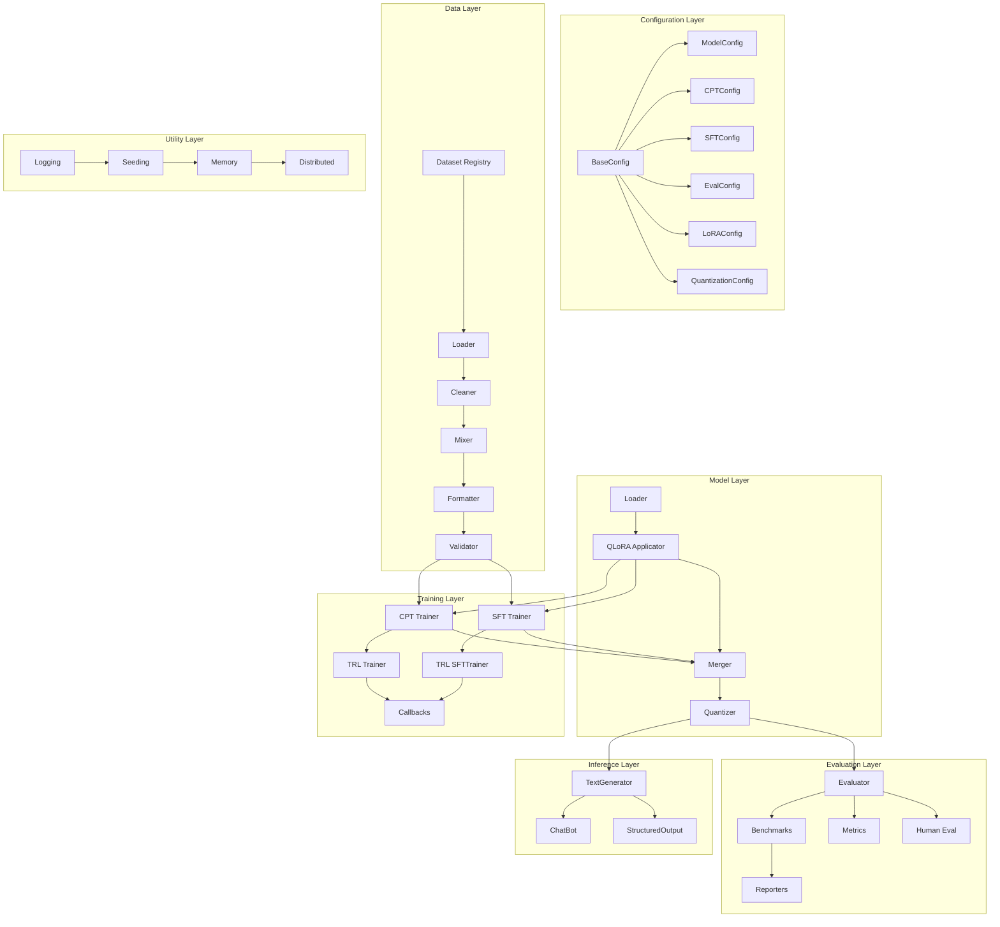
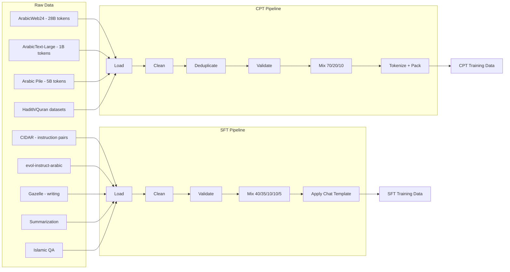
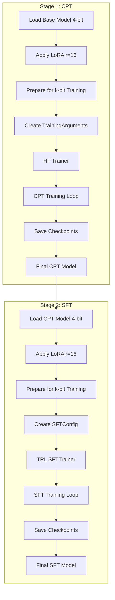
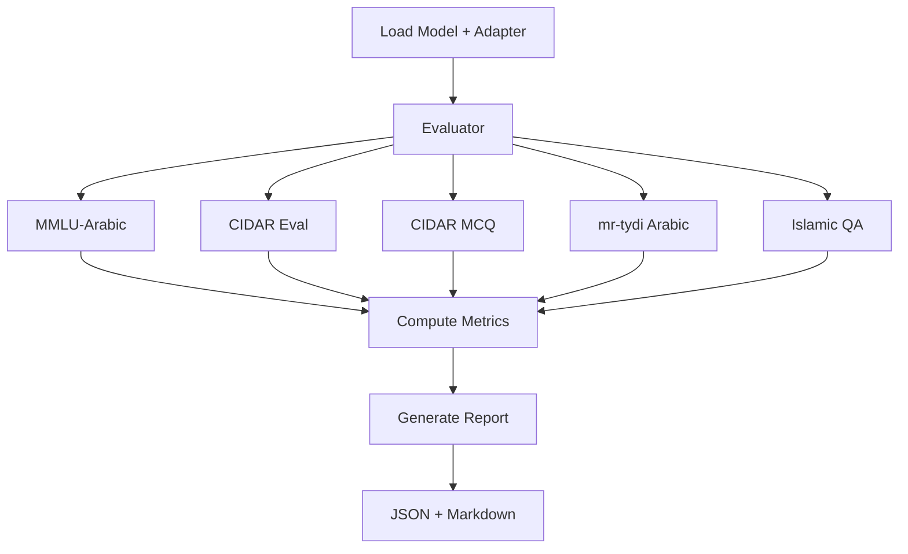
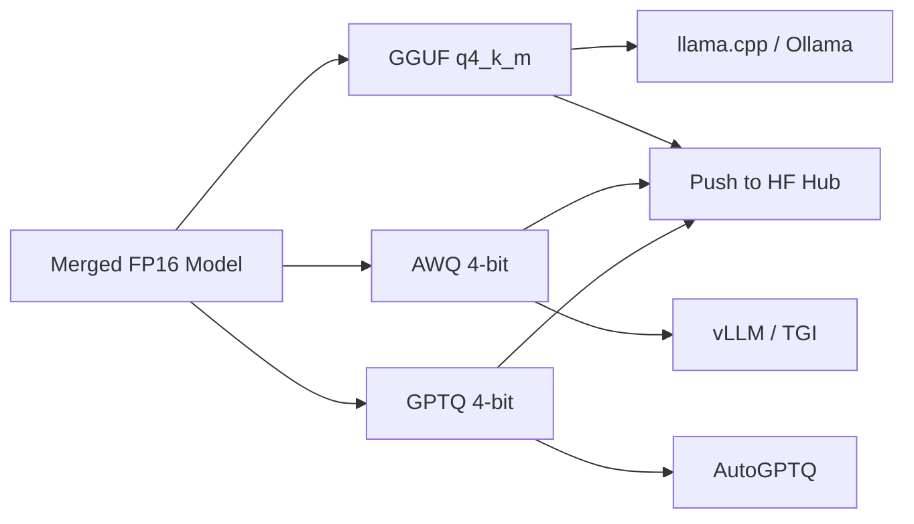
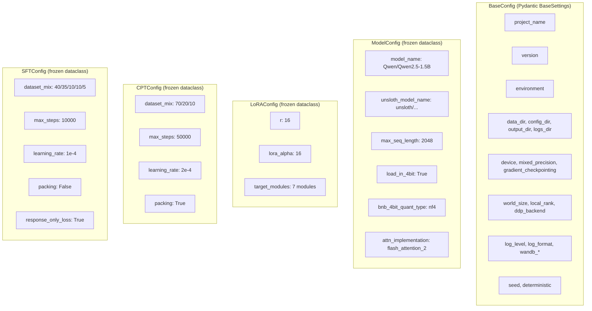

# Architecture - Baligh-1.5B v0

## System Architecture Overview



---

## Package Structure

```
src/baligh/
├── __init__.py
├── config.py              # Pydantic settings + frozen dataclasses
├── constants.py           # Paths, model names, dataset ratios
├── data/                  # Data pipeline (7 files)
│   ├── __init__.py        # Public API re-exports
│   ├── datasets.py        # Dataset registry with metadata
│   ├── loader.py          # HF dataset loading by name
│   ├── cleaner.py         # HTML/URL removal, Arabic normalization
│   ├── mixer.py           # Ratio-based interleaving
│   ├── formatter.py       # CPT packing + SFT chat template
│   └── validators.py      # Schema + quality validation
├── training/              # Training loops (7 files)
│   ├── __init__.py        # Public API re-exports
│   ├── cpt_trainer.py     # CPT training with HF Trainer
│   ├── sft_trainer.py     # SFT training with TRL SFTTrainer
│   ├── lora_config.py     # LoRA + BitsAndBytes config creation
│   ├── callbacks.py       # Logging, memory, checkpoint callbacks
│   ├── metrics.py         # Loss, perplexity computation
│   └── checkpoint.py      # Save/load/cleanup checkpoints
├── models/                # Model management (4 files)
│   ├── __init__.py        # Public API re-exports
│   ├── loader.py          # load_base_model, apply_lora, merge_lora
│   ├── tokenizer.py       # Qwen2.5 tokenizer + chat template
│   └── quantization.py    # GGUF, AWQ, GPTQ export
├── evaluation/            # Evaluation (6 files)
│   ├── __init__.py        # Public API re-exports
│   ├── evaluator.py       # Main Evaluator class
│   ├── benchmarks.py      # MMLU-Arabic, CIDAR, Islamic QA
│   ├── metrics.py         # ROUGE, BLEU, BERTScore, EM
│   ├── human_eval.py      # Human eval rubric system
│   └── reporters.py       # JSON/Markdown report generation
├── inference/             # Inference (4 files)
│   ├── __init__.py        # Public API re-exports
│   ├── generator.py       # TextGenerator (single/batch)
│   ├── chat.py            # ChatBot (history + system prompts)
│   └── structured.py      # JSON extraction with retries
└── utils/                 # Utilities (5 files)
    ├── __init__.py
    ├── logging.py         # Loguru setup (JSON/text, rotation)
    ├── seeding.py         # Deterministic seeding across all libs
    ├── memory.py          # GPU memory tracking + estimation
    └── distributed.py     # DDP helpers (barrier, reduce, gather)
```

---

## Data Flow Architecture



---

## Training Pipeline



---

## Evaluation Pipeline



---

## Deployment Pipeline



---

## Key Design Patterns

### 1. Registry Pattern
**Location**: `src/baligh/data/datasets.py`

The `DATASETS` dictionary maps string names to configuration dictionaries. Each entry contains the HF path, split, streaming flag, column names, license, token count, domain, and type.

### 2. Factory Pattern
**Location**: `src/baligh/config.py` (factory functions), `src/baligh/data/loader.py`, `src/baligh/models/loader.py`

Factory functions create configured instances without exposing construction details.

### 3. Strategy Pattern
**Location**: `src/baligh/data/formatter.py`

`PromptFormatter.__call__()` dispatches based on the batch schema:
- If batch contains `instruction` key: use SFT formatting (chat template)
- If batch contains `text` key: use CPT formatting (raw tokenization)

### 4. Template Method Pattern
**Location**: `src/baligh/training/cpt_trainer.py`, `src/baligh/training/sft_trainer.py`

Both `CPTTrainer` and `SFTTrainer` follow the same lifecycle:
1. `__init__` - Setup config, tokenizer, model, training args, trainer
2. `_setup_model` - Load base model, apply LoRA, prepare for k-bit
3. `_create_training_args` - Build TrainingArguments from config
4. `_create_trainer` - Build Trainer/SFTTrainer instance
5. `train()` - Run training, save model
6. `save_model()` - Save to disk

### 5. Pipeline Pattern
**Location**: `src/baligh/data/cleaner.py`

The `CleaningPipeline` chains multiple text transformations.

### 6. Callback Pattern
**Location**: `src/baligh/training/callbacks.py`

Three `TrainerCallback` subclasses hook into training events.

### 7. Facade Pattern
**Location**: `src/baligh/data/__init__.py`, `src/baligh/models/__init__.py`

Each package's `__init__.py` re-exports a curated public API.

---

## Configuration Hierarchy


