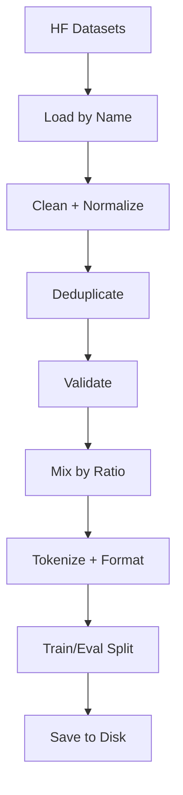

# Data Flow - Baligh-1.5B v0

## End-to-End Data Pipeline Overview



---

## The 7 Pipeline Stages

### Stage 1: Dataset Registry

`src/baligh/data/datasets.py` contains the `DATASETS` dictionary — a central registry mapping dataset names to their HF paths, splits, column names, licenses, and token estimates.

**CPT datasets** (type `cpt`):
- `arabicweb24` — `lightonai/ArabicWeb24` (streaming, ~28B tokens)
- `arabictext_large` — `Jr23xd23/ArabicText-Large` (non-streaming, ~1B tokens)
- `arabic_pile` — `premio-ai/TheArabicPile_Dialects` (streaming, ~5B tokens)

**Islamic CPT datasets** (type `cpt_islamic`):
- `hadith_datasets` — `meeAtif/hadith_datasets`
- `quran_qa` — `nazimali/quran-question-answer-context`
- `quran_md` — `Buraaq/quran-audio-text-dataset`

**SFT datasets** (type `sft`):
- `cidar` — `arbml/CIDAR` (instruction/input/output)
- `evol_instruct_arabic` — `FreedomIntelligence/evol-instruct-arabic`
- `gazelle` — `Gazelle/arabic-writing`
- `summarization` — `BounharAbdelaziz/arabic-msa-summarization` (text/summary)

**Eval datasets** (type `eval`):
- `mmlu_arabic` — `FreedomIntelligence/MMLU_Arabic`
- `cidar_eval` — `arbml/CIDAR` (test split)
- `mr_tydi_arabic` — `castorini/mr-tydi` (arabic)

---

### Stage 2: Loading

`src/baligh/data/loader.py` provides `load_dataset_by_name()` which looks up the registry and calls HF `load_dataset()` with the correct path, split, and streaming flags.

Key design choices:
- **Streaming mode** for large web corpora (ArabicWeb24, Arabic Pile) to avoid downloading 30+ GB
- **Non-streaming** for smaller datasets (ArabicText-Large, all SFT datasets)

---

### Stage 3: Cleaning

`src/baligh/data/cleaner.py` provides `CleaningPipeline`:

1. **HTML tag removal** — Strip HTML tags from web-scraped text
2. **URL removal** — Remove http/https patterns
3. **Arabic normalization**:
   - Alef variants (alef with hamza, alef with madda) → plain alef
   - Yaa variants (tail yaa) → standard yaa
   - Tatweel (elongation character) → removed
   - Tashkeel (diacritics) → optionally stripped
4. **Whitespace normalization** — Collapse multiple spaces/newlines
5. **Quality filters** — Min/max length, language detection

---

### Stage 4: Deduplication (Optional)

MinHash LSH (Locality-Sensitive Hashing) for near-duplicate detection:
1. Compute MinHash signatures (hash-based document fingerprints)
2. Use LSH to find candidate pairs efficiently
3. Remove documents with Jaccard similarity above threshold

Critical for Arabic web data where content is syndicated across news sites.

---

### Stage 5: Validation

`src/baligh/data/validators.py`:

**CPT validation** (`validate_cpt_example`):
- `text` field must exist and be a string
- Length >= 50 chars (too short = noise)
- Length <= 100,000 chars (too long = HTML leakage)

**SFT validation** (`validate_sft_example`):
- `instruction` and `output` must exist and be strings
- `instruction` length >= 5 chars
- `output` length >= 5 chars

`validate_dataset()` runs validation across the entire dataset and returns counts of valid/invalid examples with error breakdown.

---

### Stage 6: Mixing by Ratio

`src/baligh/data/mixer.py` — `DatasetMixer` uses `interleave_datasets()`:

```python
interleave_datasets(
    datasets=[arabicweb24, arabictext_large, arabic_pile],
    probabilities=[0.70, 0.20, 0.10],
    seed=42,
    stopping_strategy='first_exhausted'
)
```

**CPT ratios** (from `CPTConfig.dataset_mix`):
- arabicweb24: 70%
- arabictext_large: 20%
- arabic_pile: 10%

**SFT ratios** (from `SFTConfig.dataset_mix`):
- cidar: 40%
- evol_instruct_arabic: 35%
- gazelle: 10%
- summarization: 10%
- islamic_qa: 5%

`stopping_strategy='first_exhausted'` stops when the smallest dataset runs out.

---

### Stage 7: Formatting

`src/baligh/data/formatter.py` — `PromptFormatter`:

**CPT formatting** (`format_cpt_batch`):
1. Tokenize raw text with Qwen2.5 tokenizer
2. Truncate to `max_seq_length` (2048)
3. Set `labels = input_ids` (standard causal LM objective)
4. Return `input_ids`, `attention_mask`, `labels`

**SFT formatting** (`format_sft_batch`):
1. Build message list with user and assistant roles
2. Apply Qwen2.5 chat template (im_start/im_end tokens)
3. Tokenize the formatted string
4. Set `labels = input_ids` (response-only loss is handled at training time)

---

### Stage 8: Split and Save

**CPT**: 99% train, 1% eval (or 1000 eval samples for streaming)
**SFT**: 98% train, 2% eval

Saved using HF `save_to_disk()` in Arrow format with `metadata.json`.

---

## Entry Point: prepare_data.py

`src/scripts/prepare_data.py` orchestrates the entire pipeline via the `DataPreparator` class which handles loading, cleaning, deduplication, validation, mixing, formatting, splitting, and saving.

---

## Data Format After Pipeline

**CPT output** (per example): `{input_ids, attention_mask, labels}` where labels equal input_ids (causal LM objective).

**SFT output** (per example): `{input_ids, attention_mask, labels}` where the sequence contains the full chat template with user and assistant turns.
