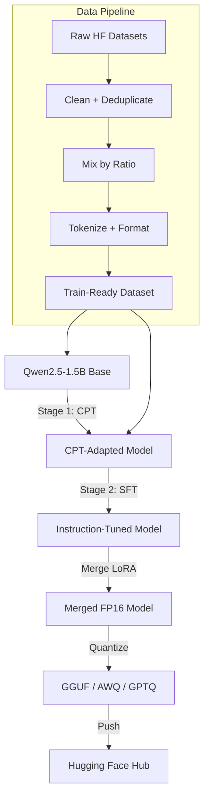

# 00 — Project Overview: Baligh-1.5B v0

## What Baligh-1.5B v0 Is

**Baligh-1.5B v0** is an Arabic-first, Islamic-knowledge-specialized large language model with approximately 1.54 billion parameters. It is built on top of **Qwen2.5-1.5B Base** — a decoder-only causal language model originally trained by Alibaba on multilingual data — and is adapted to Arabic and Islamic domains through a two-stage training pipeline:

1. **Continued Pretraining (CPT)** — Domain adaptation on 20–50B Arabic tokens from web, general, and Islamic corpora.
2. **Supervised Fine-Tuning (SFT)** — Instruction tuning on 100K–500K Arabic instruction-response pairs.

Both stages use **QLoRA 4-bit** via the **Unsloth** training toolkit, enabling training on consumer-grade GPUs (e.g., a single 24 GB RTX 4090 or A5000).

## Why It Exists

Arabic NLP has historically lagged behind English in open-source LLM availability. While models like Qwen2.5 have strong multilingual support, they are not specifically tuned for:
- Arabic formal language (Fusha) fluency
- Islamic knowledge domains (fiqh, tafsir, hadith, aqidah)
- Arabic instruction-following at a conversational level

Baligh fills this gap as a small, efficient, open-weight model that developers can deploy on edge devices or fine-tune further for specific Arabic use cases.

## Target Users

| User | Use Case |
|------|----------|
| Arabic NLP researchers | Benchmarking, transfer learning, Arabic-specific tasks |
| Islamic app developers | Quran/tafsir/fiqh QA tools, hadith search assistants |
| Arabic chatbot builders | Customer service, education, content generation |
| Edge deployment | On-device Arabic assistants (phones, IoT) |

## Non-Goals (Explicitly Out of Scope)

- **Not a general chatbot**: It is domain-specialized, not a ChatGPT competitor.
- **Not a fatwa authority**: It can assist with Islamic knowledge but does NOT issue binding religious rulings.
- **Not multilingual**: Arabic is primary; English is secondary and incidental from the base model.
- **Not a RAG replacement**: For high-factuality Islamic QA, it must be paired with a retrieval system.

## High-Level Architecture



## Project Structure at a Glance

```
Baligh/
├── src/baligh/           # Core library (config, data, training, models, eval, inference, utils)
├── src/scripts/          # CLI entry points (prepare_data, run_cpt, run_sft, run_eval, etc.)
├── configs/              # YAML configs for base model, CPT stages, SFT stages, eval
├── docker/               # Dockerfiles for reproducible training environments
├── colab_cli/            # Google Colab notebooks + CLI runner
├── docs/                 # Architecture, training, evaluation, release docs
├── requirements/         # Pip requirements split by concern
└── pyproject.toml        # Package metadata
```

## Key Entry Points

| Script | Purpose |
|--------|---------|
| `src/scripts/prepare_data.py` | Download → clean → mix → format → validate → export datasets |
| `src/scripts/run_cpt.py` | Run Continued Pretraining stage |
| `src/scripts/run_sft.py` | Run Supervised Fine-Tuning stage |
| `src/scripts/run_eval.py` | Evaluate on Arabic and Islamic benchmarks |
| `src/scripts/merge_lora.py` | Merge LoRA adapters into base model |
| `src/scripts/quantize.py` | Export to GGUF / AWQ / GPTQ |
| `src/scripts/push_to_hf.py` | Push models to Hugging Face Hub |

## Configuration System

All configuration is managed through **Pydantic BaseSettings** (`src/baligh/config.py`):
- `BaseConfig` — Environment variables, paths, hardware, logging, reproducibility
- `ModelConfig` — Model name, tokenizer, quantization settings, attention implementation
- `LoRAConfig` — LoRA rank, alpha, dropout, target modules
- `CPTConfig` — Dataset mix ratios, training hyperparameters, packing settings
- `SFTConfig` — Dataset mix ratios, training hyperparameters, response-only loss
- `EvalConfig` — Benchmark selection, generation parameters, human eval rubric
- `QuantizationConfig` — GGUF, AWQ, GPTQ settings

Each config class is a frozen dataclass (immutable) with sensible defaults. Configs can be loaded from YAML files or environment variables.

## Training Method: QLoRA 4-bit

The core training innovation is **QLoRA** (Quantized Low-Rank Adaptation):
1. Load the base model in 4-bit precision using NF4 (Normal Float 4) quantization via BitsAndBytes.
2. Freeze all base model weights.
3. Inject LoRA adapter matrices (rank=16) into attention and MLP layers.
4. Only train the adapter parameters (~0.1% of total params).
5. After training, merge adapters back into the full-precision model.
6. Optionally re-quantize for deployment (GGUF for llama.cpp, AWQ for vLLM, GPTQ for text-generation-inference).

This approach reduces VRAM requirements from ~12 GB (full FP16) to ~4 GB (QLoRA 4-bit), making training accessible on consumer GPUs.

## Evaluation Strategy

Baligh is evaluated on:
- **MMLU-Arabic** — Multiple-choice knowledge benchmark in Arabic
- **CIDAR** — Arabic instruction-following benchmark (ROUGE, BLEU)
- **mr-tydi-arabic** — Arabic retrieval-augmented QA
- **Islamic QA (custom)** — Fiqh, hadith, tafsir questions (ROUGE, exact match)
- **Perplexity** — Language modeling quality on held-out Arabic text
- **Human evaluation** — 5-point rubric (correctness, clarity, Arabic quality, usefulness, faithfulness)

## Release Artifacts

| Artifact | Description |
|----------|-------------|
| Base CPT model | After Stage 1, before SFT |
| Instruct model | After SFT (with LoRA adapters) |
| Merged model | LoRA merged into base weights |
| GGUF quantized | `q4_k_m` for llama.cpp / Ollama |
| AWQ quantized | 4-bit for vLLM deployment |
| GPTQ quantized | 4-bit for text-generation-inference |
| Model card | Auto-generated with eval scores |
| Evaluation report | JSON + Markdown results |

## Summary

Baligh-1.5B v0 is a complete, reproducible pipeline for building a small Arabic-specialized LLM — from raw data to deployed quantized model. It demonstrates that with QLoRA and smart data mixing, a single consumer GPU can train a useful Arabic assistant with Islamic knowledge capabilities.
