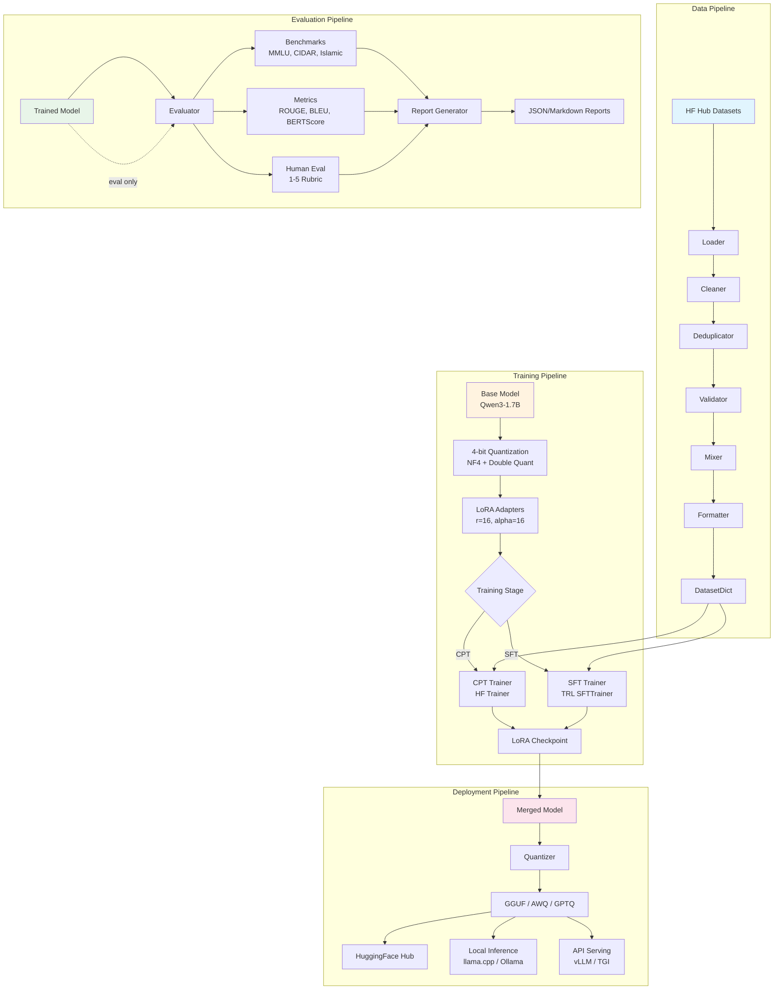
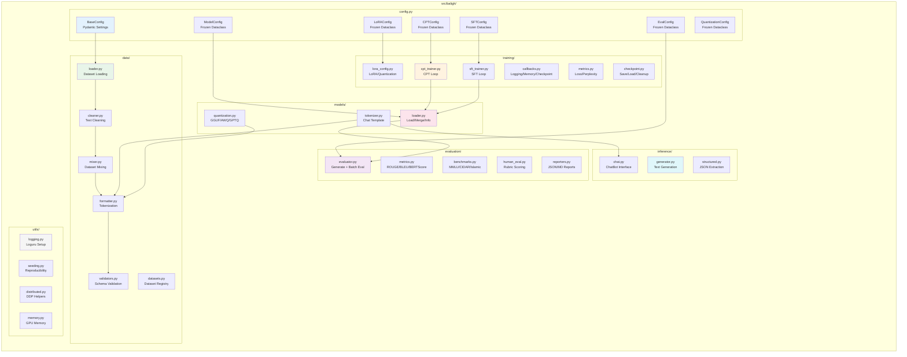
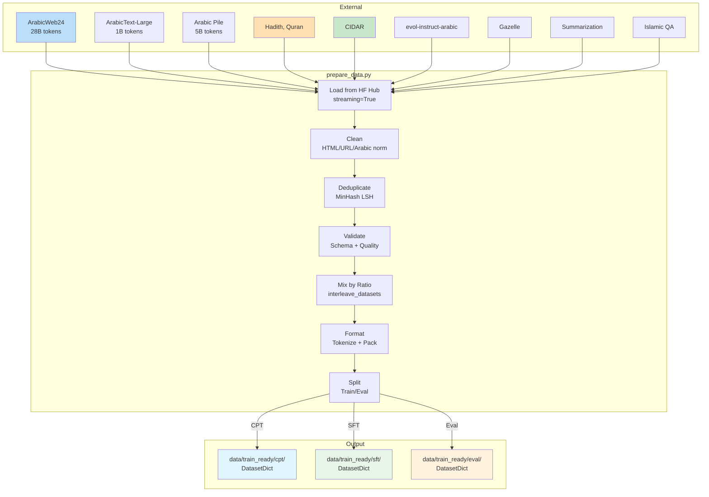
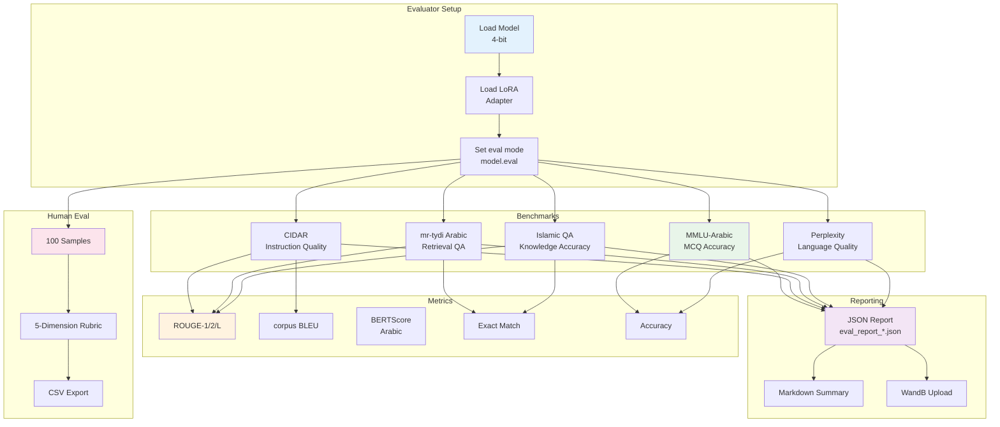
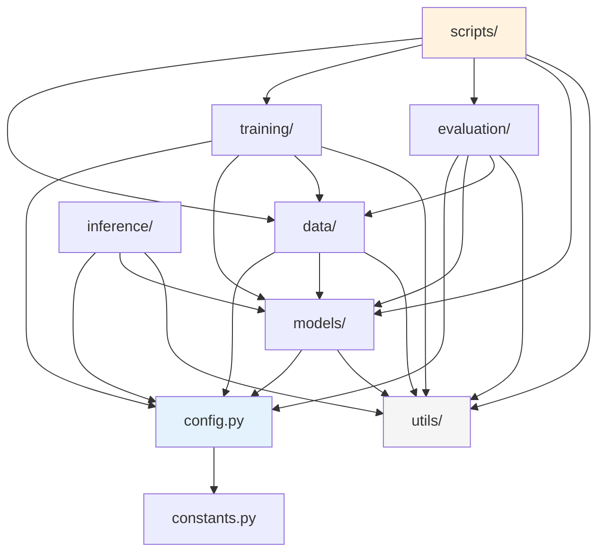

# 01 — Architecture: Baligh-1.7B v0

## High-Level Architecture



---

## Module Architecture



---

## Data Flow Architecture



---

## Training Flow Architecture

```mermaid
flowchart TD
    subgraph "Stage 1: CPT"
        C1[Load Qwen3-1.7B<br/>4-bit NF4] --> C2[Apply LoRA<br/>r=16, alpha=16]
        C2 --> C3[Prepare for<br/>k-bit Training]
        C3 --> C4[CPT Data<br/>50K steps]
        C4 --> C5[Train<br/>AdamW, Cosine LR]
        C5 --> C6[Save Checkpoint]
        C6 --> C7[Load Best<br/>by eval_loss]
    end

    subgraph "Stage 2: Islamic CPT"
        I1[Load CPT Checkpoint] --> I2[Islamic Data<br/>5K steps]
        I2 --> I3[Train<br/>LR=1e-4]
        I3 --> I4[Save Checkpoint]
    end

    subgraph "Stage 3: SFT"
        S1[Load CPT+Islamic<br/>Checkpoint] --> S2[Apply LoRA<br/>r=16, alpha=16]
        S2 --> S3[SFT Data<br/>10K steps]
        S3 --> S4[Train<br/>TRL SFTTrainer<br/>Response-only Loss]
        S4 --> S5[Save Checkpoint]
        S5 --> S6[Load Best<br/>by eval_loss]
    end

    subgraph "Stage 4: SFT Stage 2"
        S7[Load SFT Checkpoint] --> S8[Hard Cases<br/>Islamic QA 15%]
        S8 --> S9[Train<br/>LR=5e-5]
        S9 --> S10[Final SFT]
    end

    C7 --> I1
    I4 --> S1
    S6 --> S7
    S10 --> M1[Merge LoRA<br/>into Base Weights]
    M1 --> M2[Quantize<br/>GGUF/AWQ/GPTQ]
    M2 --> M3[Push to HF Hub]

    style C1 fill:#e3f2fd
    style I1 fill:#fff3e0
    style S1 fill:#e8f5e9
    style M1 fill:#fce4ec
```



---

## Evaluation Flow



---

## Package Dependency Graph



---

## Key Interfaces

### Model Loading Interface
```python
# Loading
model = load_base_model(model_name, load_in_4bit=True)
model = apply_lora(model, lora_config)
model = prepare_model_for_kbit_training(model)

# Inference
generator = TextGenerator(model_path, adapter_path)
response = generator.generate(prompt, max_new_tokens=512)

# Chat
bot = ChatBot(model_path, adapter_path, system_prompt)
response = bot.chat(user_message)

# Merge & Export
merged = merge_lora(model, save_path)
quantize_gguf(model_path, output_path, quantization)
```

### Data Pipeline Interface
```python
# Loading
datasets = load_cpt_datasets(streaming=True)
datasets = load_sft_datasets()

# Processing
cleaned = cleaning_pipeline.clean_batch(texts)
mixed = mix_cpt_datasets(datasets, seed=42)
formatted = mixed.map(formatter, batched=True)

# Validation
valid, invalid, errors = validate_dataset(ds, dataset_type="cpt")
```

### Evaluation Interface
```python
# Setup
evaluator = Evaluator(model_path, adapter_path)

# Benchmarks
results = run_mmlu_arabic(evaluator, max_samples=100)
results = run_cidar_eval(evaluator, max_samples=100)
results = run_islamic_qa(evaluator, dataset, max_samples=100)

# Metrics
rouge = compute_rouge(predictions, references)
bleu = compute_bleu(predictions, references)
bert = compute_bert_score(predictions, references, lang="ar")

# Reporting
generate_eval_report(results, output_dir)
```

---

## Configuration Hierarchy

```mermaid
flowchart TD
    subgraph "Environment"
        ENV[.env file<br/>HF_TOKEN, WANDB_API_KEY]
    end

    subgraph "YAML Configs"
        Y1[configs/base/model.yaml]
        Y2[configs/base/hardware.yaml]
        Y3[configs/cpt/cpt-stage1.yaml]
        Y4[configs/cpt/cpt-stage2.yaml]
        Y5[configs/cpt/cpt-islamic.yaml]
        Y6[configs/sft/sft-stage1.yaml]
        Y7[configs/sft/sft-stage2.yaml]
        Y8[configs/eval/eval-config.yaml]
    end

    subgraph "Python Configs"
        P1[BaseConfig<br/>Pydantic Settings]
        P2[ModelConfig<br/>Dataclass]
        P3[LoRAConfig<br/>Dataclass]
        P4[CPTConfig<br/>Dataclass]
        P5[SFTConfig<br/>Dataclass]
        P6[EvalConfig<br/>Dataclass]
    end

    subgraph "CLI Args"
        C1[--data-dir]
        C2[--output-dir]
        C3[--config]
        C4[--resume]
        C5[--max-samples]
    end

    ENV --> P1
    Y1 --> P2
    Y3 --> P4
    Y6 --> P5
    Y8 --> P6
    C1 & C2 & C3 & C4 & C5 -->|override| P4 & P5

    style ENV fill:#ffe0b2
    style Y1 fill:#e3f2fd
    style P1 fill:#e8f5e9
    style C1 fill:#fce4ec
```



**Priority order**: CLI args > YAML config > Python defaults > Environment variables
