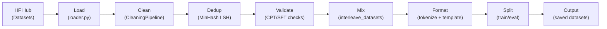
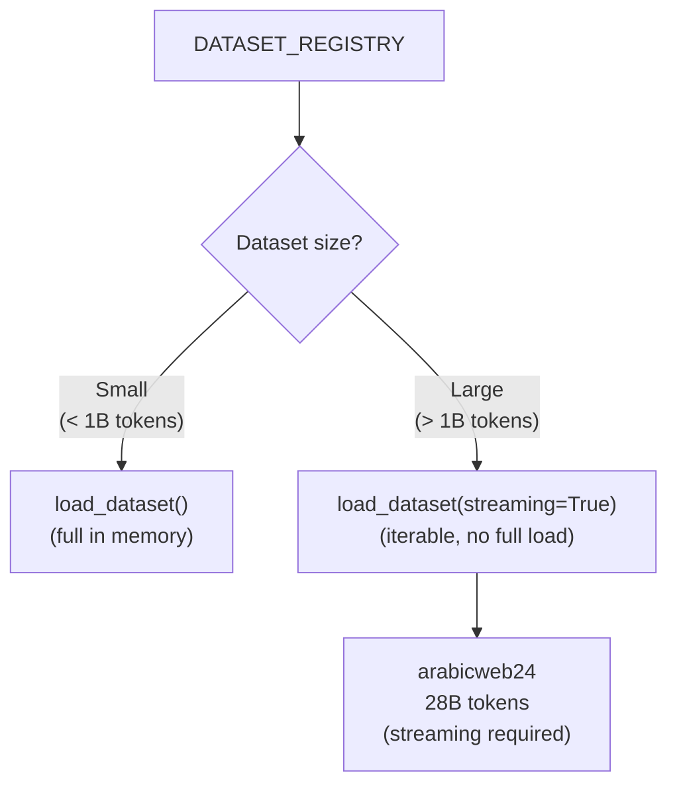
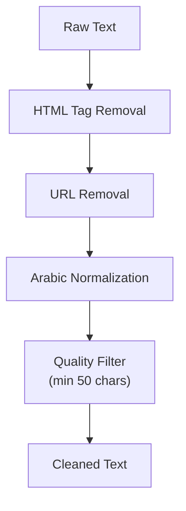
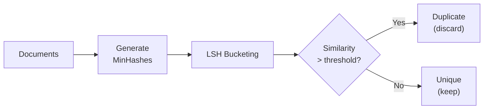
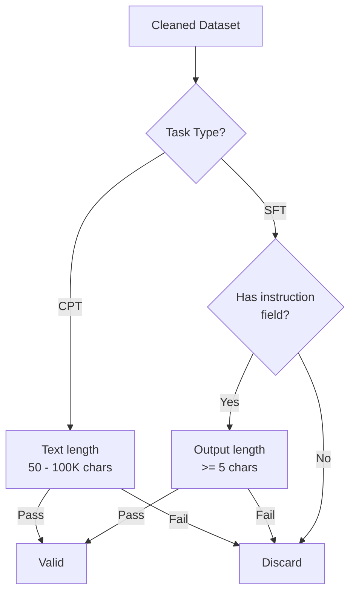
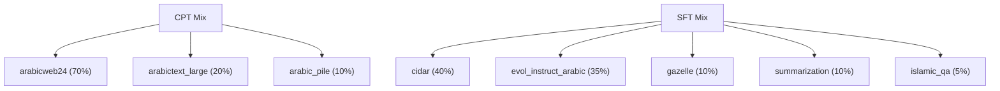
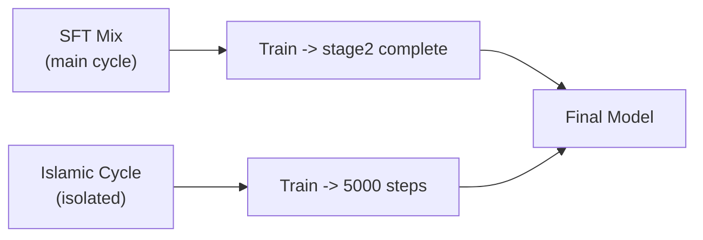
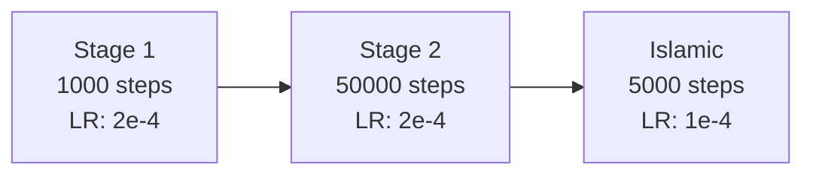

# Data Flow: Baligh-1.5B v0

## End-to-End Pipeline Overview



> Dedup (Step 3) is **optional** and applies only to web corpora.

---

## Step 1: Load

**Source**: `loader.py` with `DATASET_REGISTRY`

All datasets are registered in a central dictionary mapping dataset names to their HuggingFace identifiers and configurations.



- **Streaming** is used for `arabicweb24` (28B tokens) -- the full dataset exceeds memory, so it is consumed as an iterable.
- Smaller datasets (`cidar`, `evol_instruct_arabic`, `gazelle`, etc.) are loaded fully into memory.

---

## Step 2: Clean

**Source**: `CleaningPipeline` class

Applied via `Dataset.map()` with `batched=True` and `num_proc=8` for parallel processing.



### Arabic Normalization Rules

| Pattern | Replacement | Description |
|---------|-------------|-------------|
| Alef variants | bare Alef | alef-madda, alef-with-hamza-above/below |
| Yaa variants | bare Yaa | alef-maqsurah, yaa-with-dots-below |
| Tatweel | removed | Tatweel/kashida character stripped |
| Hamza variants | bare Hamza | hamza-on-waw, hamza-on-yaa, hamza-above/below |

### Cleaning Steps

| Order | Operation | Detail |
|-------|-----------|--------|
| 1 | HTML removal | Strip all HTML tags |
| 2 | URL removal | Remove URLs and web references |
| 3 | Arabic normalization | Alef, Yaa, Tatweel, Hamza normalization |
| 4 | Quality filter | Discard documents shorter than 50 characters |

### Execution Configuration

```python
Dataset.map(
    cleaning_fn,
    batched=True,
    num_proc=8
)
```

---

## Step 3: Dedup (Optional)

**Algorithm**: MinHash Locality-Sensitive Hashing (LSH)

Used for **web corpora only** (e.g., `arabicweb24`). Not applied to curated-quality datasets.



- Detects **near-duplicates** (not just exact matches).
- Essential for web-scraped content where boilerplate and near-identical pages are common.

---

## Step 4: Validate

Validation rules differ by task type (CPT vs SFT).



| Task | Requirement | Rationale |
|------|-------------|-----------|
| CPT | Text 50-100,000 chars | Too short = low signal; too long = memory waste |
| SFT | Instruction present | Core requirement for instruction-following |
| SFT | Output >= 5 chars | Ensures meaningful response content |

---

## Step 5: Mix

**Method**: `interleave_datasets()` with `probabilities` and `first_exhausted` stopping strategy.



### Mixing Strategy

- **`interleave_datasets`**: Samples from each dataset according to the given probabilities.
- **`first_exhausted`**: Training stops when the first (most-used) dataset runs out.

### CPT Probabilities

| Dataset | Probability |
|---------|-------------|
| arabicweb24 | 70% |
| arabictext_large | 20% |
| arabic_pile | 10% |

### SFT Probabilities

| Dataset | Probability |
|---------|-------------|
| cidar | 40% |
| evol_instruct_arabic | 35% |
| gazelle | 10% |
| summarization | 10% |
| islamic_qa | 5% |

### Islamic Cycle

The `islamic_qa` dataset is trained in a **separate isolated cycle** rather than being interleaved into the main SFT mix. This allows:

- Dedicated fine-tuning on Islamic knowledge.
- Independent control over Islamic domain training duration.



---

## Step 7: Split

After formatting, the dataset is split into train and eval sets.

| Task Type | Train | Eval | Rationale |
|-----------|-------|------|-----------|
| CPT | 99% | 1% | Massive data; 1% eval is sufficient |
| SFT | 98% | 2% | Smaller datasets; 2% eval for better signal |

---

## CPT vs SFT Comparison

| Aspect | CPT (Continual Pre-Training) | SFT (Supervised Fine-Tuning) |
|--------|------------------------------|------------------------------|
| **Goal** | Language modeling on raw Arabic text | Instruction-following capability |
| **Input** | Raw text | instruction + output pairs |
| **Template** | None (raw tokenize + pack) | Qwen2.5 chat template |
| **Labels** | labels = input_ids | Labels masked to output tokens only |
| **Validation** | Text 50-100K chars | Instruction present, output >= 5 chars |
| **Eval split** | 1% | 2% |
| **Datasets** | arabicweb24, arabictext_large, arabic_pile | cidar, evol_instruct_arabic, gazelle, summarization, islamic_qa |

---

## CPT Configuration Stages

The CPT phase runs in three sequential stages with different hyperparameters:



| Stage | Steps | Learning Rate | Purpose |
|-------|-------|---------------|---------|
| stage1 | 1,000 | 2e-4 | Quick warm-up / sanity check |
| stage2 | 50,000 | 2e-4 | Main continual pre-training |
| islamic | 5,000 | 1e-4 | Islamic domain specialization |

### Stage Details

- **Stage 1** (1,000 steps): Short warm-up run to validate the pipeline end-to-end before committing to the full training run.
- **Stage 2** (50,000 steps): The main CPT phase where the bulk of language knowledge is acquired from the mixed web and text corpora.
- **Islamic** (5,000 steps): A dedicated phase at a lower learning rate (1e-4) for fine-tuning on Islamic domain data. Runs as an isolated cycle after the main SFT is complete.