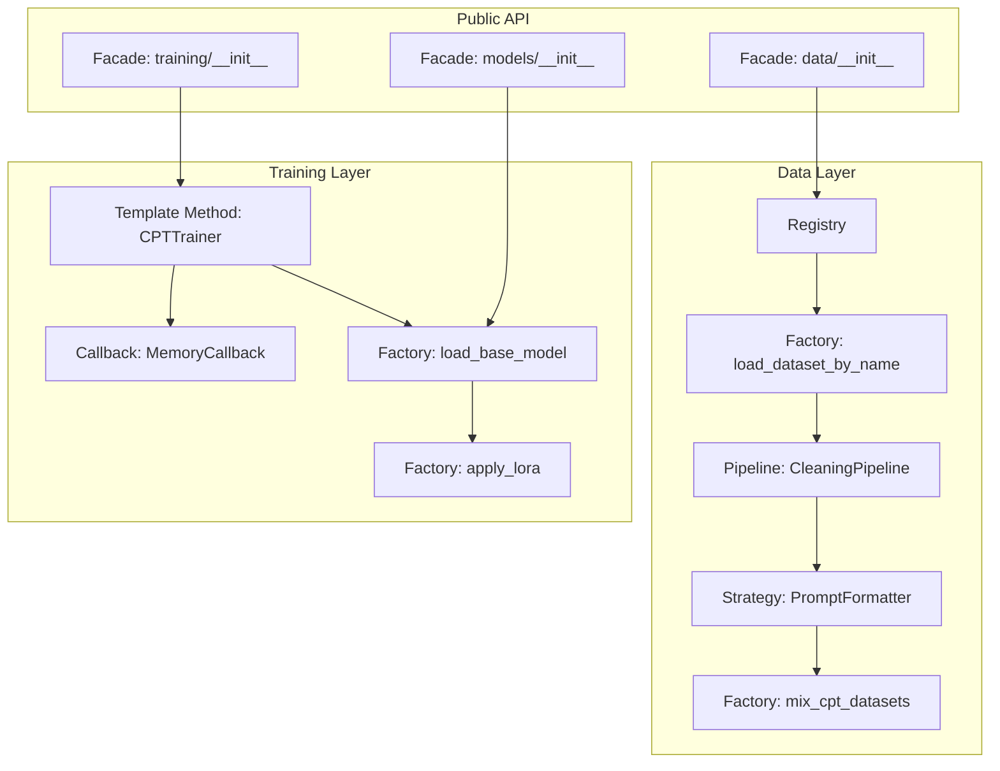

# 04 — Design Patterns: Baligh-1.7B v0

## Pattern Catalog

| Pattern | Location | Purpose |
|---------|----------|---------|
| Registry | `data/datasets.py` | Central dataset metadata dictionary |
| Factory | `config.py`, `data/loader.py`, `models/loader.py` | Create instances from config |
| Strategy | `data/formatter.py` | Dispatch formatting based on schema |
| Template Method | `training/cpt_trainer.py`, `training/sft_trainer.py` | Consistent trainer lifecycle |
| Pipeline | `data/cleaner.py` | Sequential text transformations |
| Callback | `training/callbacks.py` | Hook into training events |
| Facade | `data/__init__.py`, `models/__init__.py` | Simplified public APIs |
| Builder | `training/lora_config.py` | Construct LoRA/quantization configs |

## 1. Registry Pattern

**Location**: `src/baligh/data/datasets.py`

The `DATASETS` dictionary maps string names to configuration dictionaries. Each entry contains the HF path, split, streaming flag, column names, license, token count, domain, and type.

**Why**: Adding a new dataset requires editing one dictionary entry rather than modifying multiple files. The registry can be filtered by type (cpt, sft, eval, cpt_islamic) to get relevant datasets for each pipeline stage.

**Usage**:
```python
from baligh.data.datasets import DATASETS, get_cpt_datasets

cpt = get_cpt_datasets()  # Returns only type='cpt' entries
```

## 2. Factory Pattern

**Location**: `src/baligh/config.py` (factory functions), `src/baligh/data/loader.py`, `src/baligh/models/loader.py`

Factory functions create configured instances without exposing construction details:

- `get_config()` returns `BaseConfig()` with env var resolution
- `get_model_config()` returns `ModelConfig()` with defaults
- `get_lora_config()` returns `LoRAConfig()` with defaults
- `load_base_model()` constructs a model with quantization, device mapping, and attention settings
- `apply_lora()` constructs a PEFT model from a base model and LoRA config

**Why**: Avoids global singletons (which cause state-sharing bugs). Each factory call creates a fresh instance. Makes testing easier (override defaults per call).

## 3. Strategy Pattern

**Location**: `src/baligh/data/formatter.py`

`PromptFormatter.__call__()` dispatches based on the batch schema:
- If batch contains `instruction` key: use SFT formatting (chat template)
- If batch contains `text` key: use CPT formatting (raw tokenization)

**Why**: The same formatter class handles both training stages. The caller does not need to know which formatting strategy to use - the formatter auto-detects from the data shape.

## 4. Template Method Pattern

**Location**: `src/baligh/training/cpt_trainer.py`, `src/baligh/training/sft_trainer.py`

Both `CPTTrainer` and `SFTTrainer` follow the same lifecycle:

1. `__init__` - Setup config, tokenizer, model, training args, trainer
2. `_setup_model` - Load base model, apply LoRA, prepare for k-bit training
3. `_create_training_args` - Build TrainingArguments from config
4. `_create_trainer` - Build Trainer/SFTTrainer instance
5. `train()` - Run training, save model
6. `save_model()` - Save to disk

**Variation**: `CPTTrainer` uses HF `Trainer` with `DataCollatorForLanguageModeling`. `SFTTrainer` uses TRL `SFTTrainer` with `formatting_func` for response-only loss. The template method skeleton is identical; only the inner implementations differ.

**Why**: Ensures both training stages follow the same setup-train-save lifecycle, making it easy to add new training stages (e.g., RLHF) by following the same template.

## 5. Pipeline Pattern

**Location**: `src/baligh/data/cleaner.py`

The `CleaningPipeline` chains multiple text transformations:
1. HTML tag removal
2. URL removal
3. Arabic normalization (alef, yaa, tatweel, tashkeel)
4. Whitespace normalization
5. Quality filters

Each step is a function that takes text and returns modified text. The pipeline composes them in order.

**Why**: Text cleaning for Arabic requires many small transformations. The pipeline pattern makes each step independently testable and composable. New cleaning steps can be added without modifying existing ones.

## 6. Callback Pattern

**Location**: `src/baligh/training/callbacks.py`

Three `TrainerCallback` subclasses hook into training events:

- **LoggingCallback**: Logs metrics at each `on_log` event
- **MemoryCallback**: Logs GPU memory stats and clears cache every N steps
- **CheckpointCallback**: Triggers saves at configured intervals

**Why**: Training concerns (logging, memory management, checkpointing) are separated from the training loop. Callbacks can be added/removed without modifying the trainer code.

## 7. Facade Pattern

**Location**: `src/baligh/data/__init__.py`, `src/baligh/models/__init__.py`, `src/baligh/training/__init__.py`, `src/baligh/evaluation/__init__.py`, `src/baligh/inference/__init__.py`

Each package's `__init__.py` re-exports a curated public API:

```python
# data/__init__.py
from baligh.data.loader import load_dataset_by_name, load_cpt_datasets
from baligh.data.cleaner import CleaningPipeline, get_cleaning_pipeline
from baligh.data.mixer import DatasetMixer, mix_cpt_datasets
from baligh.data.formatter import PromptFormatter, get_cpt_formatter
```

**Why**: Users import from the package level (`from baligh.data import mix_cpt_datasets`) rather than reaching into internal modules. Internal refactoring does not break public imports.

## 8. Builder Pattern (Config)

**Location**: `src/baligh/config.py`

The `@dataclass(frozen=True, slots=True)` pattern acts as an immutable builder:

```python
@dataclass(frozen=True, slots=True)
class CPTConfig:
    dataset_mix: dict[str, float] = field(default_factory=lambda: {...})
    max_steps: int = 50000
    learning_rate: float = 2e-4
    # ... more fields with defaults
```

Instances are created with defaults and are immutable after construction. The `@field_validator` on `BaseConfig` handles path resolution during construction.

**Why**: Frozen dataclasses prevent accidental mutation during training (where configs are passed around extensively). `slots=True` reduces memory overhead. Default values make instantiation simple while allowing override.

## Pattern Interactions



## Anti-Patterns Avoided

| Anti-Pattern | What We Do Instead |
|---|---|
| God object | Each module has a single responsibility (loader, cleaner, mixer, formatter) |
| Global state | Factory functions create fresh instances; no singletons |
| Tight coupling | Package `__init__.py` facades hide internal dependencies |
| Mutable config | Frozen dataclasses prevent accidental mutation |
| Hardcoded values | All constants in `config.py` and `constants.py` |
| Monolithic training | Callbacks separate cross-cutting concerns from training loop |
